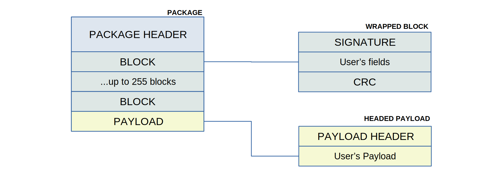

The primary unit of information in `brec` is a packet (`Packet`) — a ready-to-transmit message with a unique signature (allowing it to be recognized within mixed data) and a CRC to ensure data integrity.

A packet consists of a set of blocks (`Block`) and, optionally, a payload (`Payload`).

Blocks (`Block`) are the minimal units of information in the `brec` system. A block can contain only primitives, such as numbers, boolean values, and byte slices. A block serves as a kind of packet index, allowing for quick determination of whether a packet requires full processing (i.e., parsing the `Payload`) or can be ignored.

The payload (`Payload`) is an optional part of the packet. Unlike blocks (`Block`), it has no restrictions on the type of data it can contain—it can be a `struct` or `enum` of any complexity and nesting level.

Unlike most protocols, `brec` does not require users to define a fixed set of messages but does require them to describe blocks (`Block`) and payload data (`Payload`).

Users can construct packets (messages) by combining various sets of blocks and payloads. This means `brec` does not impose a predefined list of packets (`Packet`) within the protocol but allows them to be defined dynamically. As a result, the same block and/or payload can be used across multiple packets (messages) without any restrictions.
