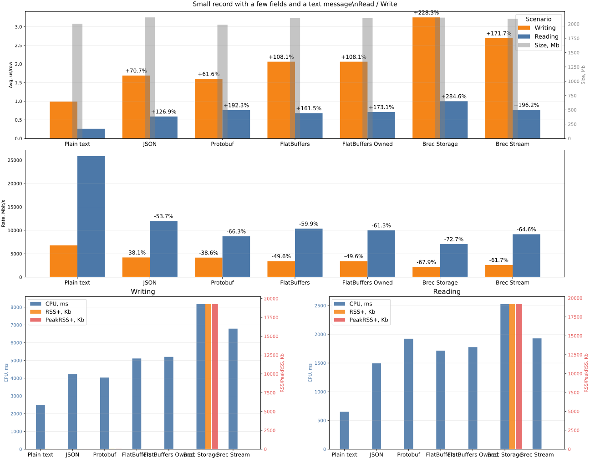
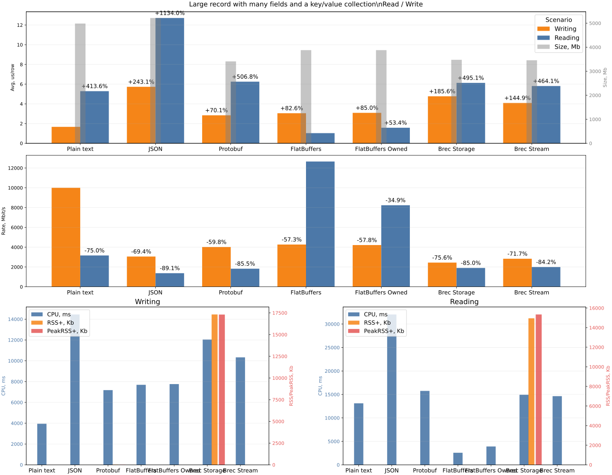
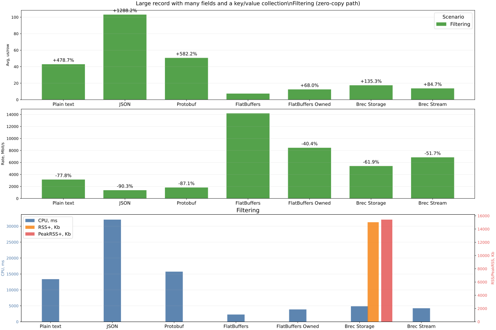
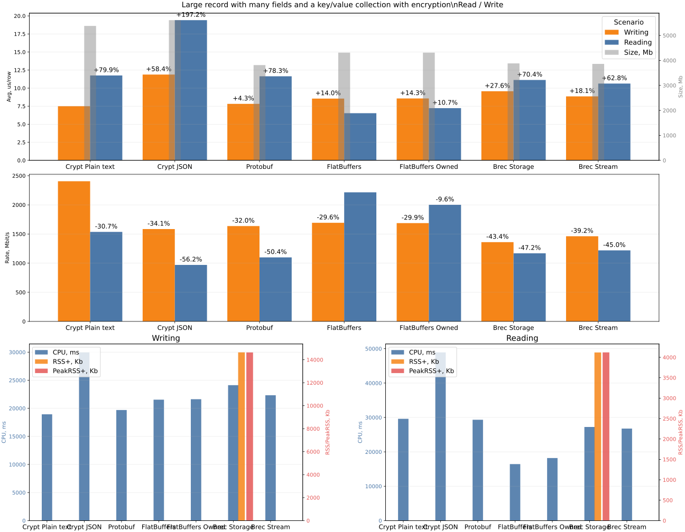
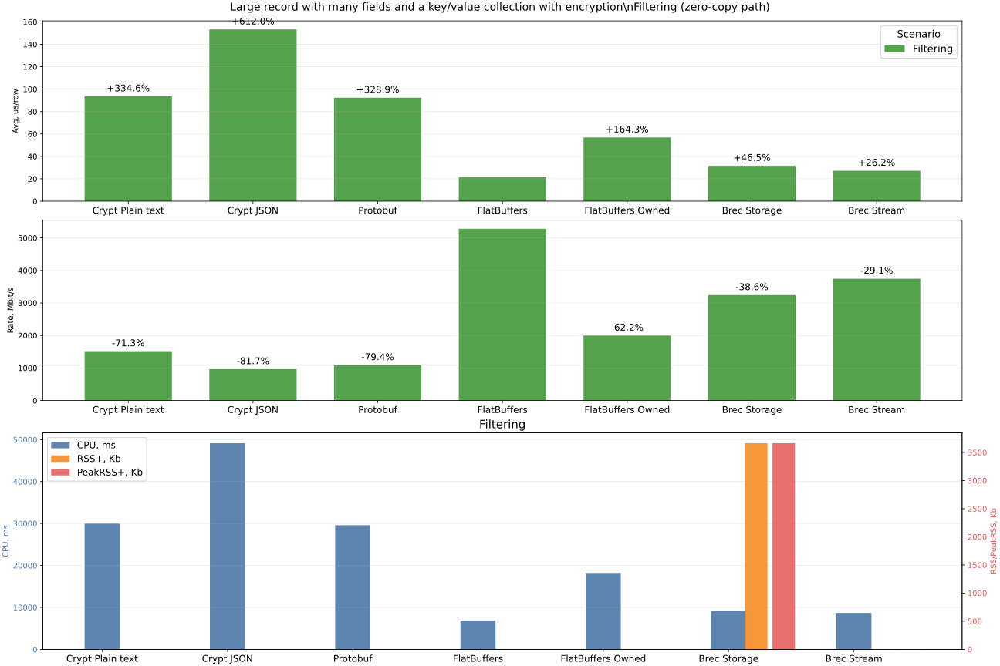
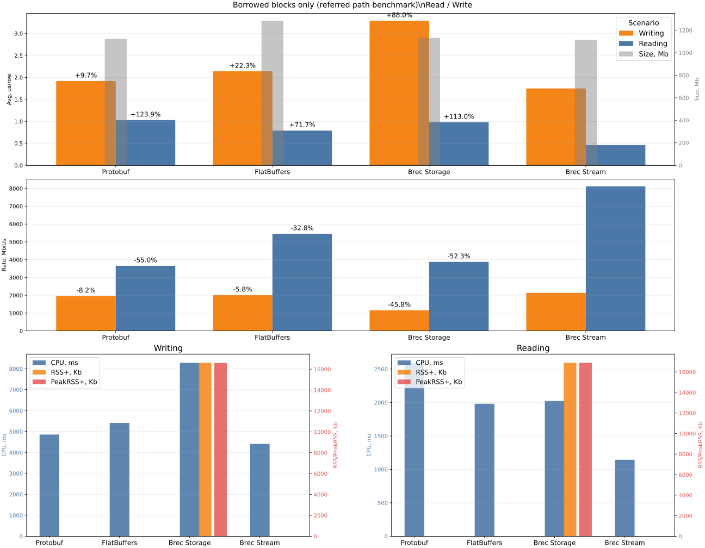

## Performance

The primary goal of these measurements is to provide a fair evaluation of the performance of the `brec` library, as well as a fair evaluation of the scenarios where using `brec` provides the highest efficiency.

When selecting protocols for comparison, the goal is not to maximize coverage of all protocols that exist today. Such measurements are unlikely to provide useful information. Instead, the "front-runners" were chosen as reference points:

- JSON as the universal and most widely used protocol today
- Protobuf as the most widely used protocol among binary formats
- FlatBuffer as a protocol based on the zero-copy concept

In addition, the benchmark includes a Plain Text scenario where writing and reading are done "as-is". This scenario is introduced as a baseline reference point.

The inclusion of FlatBuffer is justified by the fact that `brec` also combines a zero-copy approach, providing access to blocks without unnecessary memory allocation. This makes it possible to implement data filtering before the parser proceeds to process the payload.

One of the goals of these measurements is therefore to show the impact of `brec` architecture and how it defines the most efficient library usage scenarios.

### Basic Scenarios

A total of 4 main scenarios are tested:

1. Small Record: a simple small data packet. It contains a pair of numeric fields and a string payload.
2. Large Record: a larger packet with a large payload containing key/value pairs.
3. Large Record Crypted: same as the previous one, except encryption is applied to the payload (where possible). Obviously, Plain Text and JSON are encrypted entirely. Also, for benchmark fairness, exactly the same encryption approach/conditions are applied in all sub-scenarios.
4. Zero-copy test (borrowed test): this test includes only Protobuf and FlatBuffer, since comparing Plain Text and JSON here does not make sense. Protobuf should arguably also be excluded, but it is kept for comparison. The goal is to show performance when packet reading is done in zero-copy mode, where possible.

### Scope of Evaluation

Each of the scenarios above (except the last one) includes the following protocols for evaluation:

- Plain text: data processing "as-is"; no encoding or decoding
- JSON: data is converted to JSON objects
- Protobuf: data is encoded/decoded using protobuf
- FlatBuffer: data is encoded/decoded using flatbuffer
- FlatBuffer Owned: data is encoded/decoded using flatbuffer, but copied into memory at the final stage
- Brec Storage: writing and reading `brec` packets is performed through Storage (part of the `brec` toolkit). Storage is responsible not only for writing and reading, but also for "mapping" records in a file by splitting files into slots for faster record access during reads
- Brec Stream: writing and reading `brec` packets is done "as-is" into a binary file

### Operations Evaluated

Operation notes:
- Writing: packets are written to a file
- Reading: packets are read from a file
- Filtering: packets are read from a file with a filter applied; in other words, packets that do not satisfy the search condition are skipped

### Data

Common data

```rust
pub enum Level {
    Err,
    Warn,
    Info,
    Debug,
}

pub enum Target {
    Server,
    Client,
    Proxy,
}
```

Note: Conversion of `Level` and `Target` into `u8` is required but omitted here for brevity.

Small Record

```rust
#[block]
pub struct Metadata {
    pub level: Level,
    pub target: Target,
    pub tm: u64,
}

/// Data unit to be write/read & encode/decode
pub struct Record {
    pub mt: Metadata,
    pub msg: String,
}
```

Large Record & Large Record Crypted

```rust
#[block]
pub struct Metadata {
    pub level: Level,
    pub target: Target,
    pub tm: u64,
}

#[payload(bincode)]
pub struct Attachment {
    pub uuid: String,
    pub name: String,
    pub chunk: u32,
    pub data: Vec<u8>,
    pub fields: BTreeMap<String, String>,
}

/// Data unit to be write/read & encode/decode
pub struct Record {
    pub mt: Metadata,
    pub atc: Attachment,
}
```

Borrowed blocks only (referred path benchmark)

``` rust
/// Data unit to be write/read & encode/decode
#[block]
pub struct BlockBorrowed {
    pub field_u8: u8,
    pub field_u16: u16,
    pub field_u32: u32,
    pub field_u64: u64,
    pub field_u128: u128,
    pub field_i8: i8,
    pub field_i16: i16,
    pub field_i32: i32,
    pub field_i64: i64,
    pub field_i128: i128,
    pub field_f32: f32,
    pub field_f64: f64,
    pub field_bool: bool,
    pub blob_a: [u8; 100],
    pub blob_b: [u8; 255],
}
```

### Other Test Features / Characteristics

- test data is generated randomly (`proptest`)
- tests are run sequentially in a single thread
- iterations of each test are performed without refreshing the data
- data for different protocols (JSON, Protobuf, FlatBuffer, `brec`) differs slightly due to format differences, but the author tried to keep data as close as possible so the benchmarks remain fair

## Results

### Test: Small Record

|     Platform      |   Case    |  Bytes   |   Rows    | Time, ms | Avg, us/row | Rate, Mbit/s | CPU, ms | RSS,  Kb | PeakRSS,  Kb | Iterations |
|-------------------|-----------|----------|-----------|----------|-------------|--------------|---------|----------|--------------|------------|
| Plain text        | Writing   | 2,005 Mb | 2,500,000 |    2,476 |        0.99 |      6794.05 |   2,501 |       41 |           22 |         10 |
| Plain text        | Reading   | 2,005 Mb | 2,500,000 |      650 |        0.26 |     25863.75 |     653 |        0 |            0 |         10 |
| Plain text        | Filtering | 2,005 Mb |   293,500 |      759 |        2.59 |     22170.38 |     766 |        0 |            0 |         10 |
| JSON              | Writing   | 2,114 Mb | 2,500,000 |    4,217 |        1.69 |      4207.15 |   4,233 |       22 |           22 |         10 |
| JSON              | Reading   | 2,114 Mb | 2,500,000 |    1,480 |    **0.59** |     11983.78 |   1,494 |        2 |            2 |         10 |
| JSON              | Filtering | 2,114 Mb |   293,500 |    1,497 |        5.10 |     11851.88 |   1,511 |        0 |            0 |         10 |
| Protobuf          | Writing   | 1,986 Mb | 2,500,000 |    3,992 |        1.60 |      4174.13 |   4,035 |       44 |           43 |         10 |
| Protobuf          | Reading   | 1,986 Mb | 2,500,000 |    1,909 |    **0.76** |      8727.11 |   1,923 |        0 |            0 |         10 |
| Protobuf          | Filtering | 1,986 Mb |   293,500 |    1,950 |        6.64 |      8544.26 |   1,967 |        0 |            0 |         10 |
| FlatBuffers       | Writing   | 2,102 Mb | 2,500,000 |    5,155 |        2.06 |      3421.80 |   5,109 |        0 |            0 |         10 |
| FlatBuffers       | Reading   | 2,102 Mb | 2,500,000 |    1,701 |    **0.68** |     10368.76 |   1,716 |        0 |            0 |         10 |
| FlatBuffers       | Filtering | 2,102 Mb |   293,500 |    1,657 |        5.65 |     10641.21 |   1,670 |        0 |            0 |         10 |
| FlatBuffers Owned | Writing   | 2,102 Mb | 2,500,000 |    5,153 |        2.06 |      3422.94 |   5,201 |        0 |            0 |         10 |
| FlatBuffers Owned | Reading   | 2,102 Mb | 2,500,000 |    1,763 |    **0.71** |     10006.43 |   1,777 |        0 |            0 |         10 |
| FlatBuffers Owned | Filtering | 2,102 Mb |   293,500 |    1,829 |        6.23 |      9643.44 |   1,846 |        0 |            0 |         10 |
| Brec Storage      | Writing   | 2,111 Mb | 2,500,000 |    8,120 |        3.25 |      2180.72 |   8,188 |   19,298 |       19,289 |         10 |
| Brec Storage      | Reading   | 2,111 Mb | 2,500,000 |    2,509 |    **1.00** |      7058.13 |   2,530 |   19,222 |       19,222 |         10 |
| Brec Storage      | Filtering | 2,111 Mb |   293,500 |    1,441 |        4.91 |     12287.56 |   1,449 |   19,534 |       19,534 |         10 |
| Brec Stream       | Writing   | 2,091 Mb | 2,500,000 |    6,735 |        2.69 |      2605.49 |   6,792 |        0 |            0 |         10 |
| Brec Stream       | Reading   | 2,091 Mb | 2,500,000 |    1,914 |    **0.77** |      9167.30 |   1,929 |        4 |            4 |         10 |
| Brec Stream       | Filtering | 2,091 Mb |   293,500 |      863 |        2.94 |     20331.88 |     865 |        4 |            4 |         10 |




Evaluation of test results:

- In this section, Plain Text should be treated only as a baseline marker, not as a production-format competitor.
- For small packets, JSON is very strong on full reads among structured formats, while Protobuf is slightly faster on writes (the gap is on the order of tens of nanoseconds per row, not fractions of a nanosecond).
- At the same time, JSON efficiency "breaks" once filtering is involved. This is not related to format efficiency itself, but to its architecture and the fact that the message must still be fully parsed. `brec` performs best in filtering simply because the fields used for filtering are moved into blocks, which are processed before the payload and allow skipping full packet parsing.
- For full reading, Brec Stream remains close to Protobuf, while FlatBuffers is ahead by a visible but moderate margin.

### Test: Large Record

|     Platform      |   Case    |  Bytes   |   Rows    | Time, ms | Avg, us/row | Rate, Mbit/s | CPU, ms | RSS, Kb  | PeakRSS, Kb  | Iterations |
|-------------------|-----------|----------|-----------|----------|-------------|--------------|---------|----------|--------------|------------|
| Plain text        | Writing   | 4,986 Mb | 2,500,000 |    4,183 |        1.67 |     10000.53 |   3,947 |        2 |            2 |         10 |
| Plain text        | Reading   | 4,986 Mb | 2,500,000 |   13,220 |        5.29 |      3164.11 |  13,108 |        0 |            0 |         10 |
| Plain text        | Filtering | 4,986 Mb |   308,500 |   13,264 |       43.00 |      3153.45 |  13,371 |        0 |            0 |         10 |
| JSON              | Writing   | 5,216 Mb | 2,500,000 |   14,317 |        5.73 |      3056.29 |  14,454 |        0 |            0 |         10 |
| JSON              | Reading   | 5,216 Mb | 2,500,000 |   31,784 |       12.71 |      1376.68 |  32,046 |        0 |            0 |         10 |
| JSON              | Filtering | 5,216 Mb |   308,500 |   31,819 |      103.14 |      1375.19 |  32,069 |        0 |            0 |         10 |
| Protobuf          | Writing   | 3,409 Mb | 2,500,000 |    7,112 |        2.84 |      4021.85 |   7,180 |       31 |           29 |         10 |
| Protobuf          | Reading   | 3,409 Mb | 2,500,000 |   15,634 |    **6.25** |      1829.55 |  15,756 |        0 |            0 |         10 |
| Protobuf          | Filtering | 3,409 Mb |   308,500 |   15,638 |       50.69 |      1829.08 |  15,731 |        0 |            0 |         10 |
| FlatBuffers       | Writing   | 3,878 Mb | 2,500,000 |    7,618 |        3.05 |      4270.89 |   7,691 |        0 |            0 |         10 |
| FlatBuffers       | Reading   | 3,878 Mb | 2,500,000 |    2,571 |        1.03 |     12657.02 |   2,568 |        0 |            0 |         10 |
| FlatBuffers       | Filtering | 3,878 Mb |   308,500 |    2,294 |        7.43 |     14186.19 |   2,269 |        0 |            0 |         10 |
| FlatBuffers Owned | Writing   | 3,878 Mb | 2,500,000 |    7,717 |        3.09 |      4216.48 |   7,761 |        0 |            0 |         10 |
| FlatBuffers Owned | Reading   | 3,878 Mb | 2,500,000 |    3,948 |        1.58 |      8240.88 |   3,909 |        0 |            0 |         10 |
| FlatBuffers Owned | Filtering | 3,878 Mb |   308,500 |    3,850 |       12.48 |      8452.03 |   3,868 |        0 |            0 |         10 |
| Brec Storage      | Writing   | 3,476 Mb | 2,500,000 |   11,935 |        4.77 |      2443.55 |  12,042 |   17,317 |       17,304 |         10 |
| Brec Storage      | Reading   | 3,476 Mb | 2,500,000 |   15,315 |        6.13 |      1904.24 |  14,927 |   14,952 |       15,343 |         10 |
| Brec Storage      | Filtering | 3,476 Mb |   308,500 |    5,394 |       17.48 |      5406.84 |   4,858 |   15,033 |       15,424 |         10 |
| Brec Stream       | Writing   | 3,457 Mb | 2,500,000 |   10,233 |        4.09 |      2834.28 |  10,331 |        0 |            0 |         10 |
| Brec Stream       | Reading   | 3,457 Mb | 2,500,000 |   14,529 |    **5.81** |      1996.19 |  14,632 |        4 |            4 |         10 |
| Brec Stream       | Filtering | 3,457 Mb |   308,500 |    4,231 |       13.72 |      6854.39 |   4,234 |        4 |            4 |         10 |





Evaluation of test results:

- With more complex data, JSON efficiency drops dramatically. This applies to both writes and especially reads. It is particularly noticeable in the filtering task, where JSON is several times slower than other formats.
- The clear favorite in this benchmark is FlatBuffers, especially in full-read and filtering operations.
- In this benchmark, `brec` outperforms JSON across all criteria, and it also outperforms Protobuf on filtering. In write/read throughput, `brec` and Protobuf remain in the same practical range, while FlatBuffers is ahead.
- For filtering specifically, the gap between FlatBuffers and `brec` is still meaningful in this scenario, but `brec` keeps a strong advantage over JSON and Protobuf.
- Also, when working with large data structures, the efficiency of binary protocols in storage footprint and disk usage becomes noticeable. On average, binary protocols are 20-40% more compact than JSON.

### Test: Large Record Crypted

|     Platform      |   Case    |  Bytes   |   Rows    | Time, ms | Avg, us/row | Rate, Mbit/s | CPU, ms | RSS,  Kb | PeakRSS,  Kb | Iterations |
|-------------------|-----------|----------|-----------|----------|-------------|--------------|---------|----------|--------------|------------|
| Crypt Plain text  | Writing   | 5,379 Mb | 2,500,000 |   18,762 |        7.50 |      2405.31 |  18,931 |        0 |            0 |         10 |
| Crypt Plain text  | Reading   | 5,379 Mb | 2,500,000 |   29,382 |       11.75 |      1535.87 |  29,607 |        0 |            0 |         10 |
| Crypt Plain text  | Filtering | 5,379 Mb |   318,000 |   29,752 |       93.56 |      1516.79 |  29,982 |        0 |            0 |         10 |
| Crypt JSON        | Writing   | 5,610 Mb | 2,500,000 |   29,697 |       11.88 |      1584.70 |  29,963 |        0 |            0 |         10 |
| Crypt JSON        | Reading   | 5,610 Mb | 2,500,000 |   48,520 |       19.41 |       969.93 |  48,926 |        0 |            0 |         10 |
| Crypt JSON        | Filtering | 5,610 Mb |   318,000 |   48,747 |      153.29 |       965.40 |  49,144 |        0 |            0 |         10 |
| Protobuf          | Writing   | 3,812 Mb | 2,500,000 |   19,542 |    **7.82** |      1636.39 |  19,700 |        0 |            0 |         10 |
| Protobuf          | Reading   | 3,812 Mb | 2,500,000 |   29,094 |       11.64 |      1099.13 |  29,328 |        0 |            0 |         10 |
| Protobuf          | Filtering | 3,812 Mb |   318,000 |   29,365 |       92.34 |      1088.97 |  29,589 |        0 |            0 |         10 |
| FlatBuffers       | Writing   | 4,310 Mb | 2,500,000 |   21,363 |    **8.55** |      1692.56 |  21,542 |        0 |            0 |         10 |
| FlatBuffers       | Reading   | 4,310 Mb | 2,500,000 |   16,324 |    **6.53** |      2215.03 |  16,432 |        0 |            0 |         10 |
| FlatBuffers       | Filtering | 4,310 Mb |   318,000 |    6,846 |       21.53 |      5281.74 |   6,880 |        0 |            0 |         10 |
| FlatBuffers Owned | Writing   | 4,310 Mb | 2,500,000 |   21,435 |    **8.57** |      1686.91 |  21,623 |        0 |            0 |         10 |
| FlatBuffers Owned | Reading   | 4,310 Mb | 2,500,000 |   18,067 |    **7.23** |      2001.37 |  18,197 |        0 |            0 |         10 |
| FlatBuffers Owned | Filtering | 4,310 Mb |   318,000 |   18,096 |       56.90 |      1998.19 |  18,220 |        0 |            0 |         10 |
| Brec Storage      | Writing   | 3,879 Mb | 2,500,000 |   23,921 |    **9.57** |      1360.41 |  24,122 |   14,639 |       14,632 |         10 |
| Brec Storage      | Reading   | 3,879 Mb | 2,500,000 |   27,836 |       11.13 |      1169.08 |  27,235 |    4,119 |        4,121 |         10 |
| Brec Storage      | Filtering | 3,879 Mb |   318,000 |   10,033 |       31.55 |      3243.47 |   9,195 |    3,664 |        3,664 |         10 |
| Brec Stream       | Writing   | 3,860 Mb | 2,500,000 |   22,154 |    **8.86** |      1461.68 |  22,331 |        0 |            0 |         10 |
| Brec Stream       | Reading   | 3,860 Mb | 2,500,000 |   26,565 |   **10.63** |      1218.97 |  26,758 |        4 |            4 |         10 |
| Brec Stream       | Filtering | 3,860 Mb |   318,000 |    8,644 |       27.18 |      3745.90 |   8,690 |        4 |            4 |         10 |





Evaluation of test results:

- In general, the results of this test repeat the previous one, amplifying protocol issues that were already visible with large data. JSON metrics predictably worsen because the entire packet is encrypted.
- FlatBuffers, just like in the previous test, is the absolute leader overall.
- At the same time, `brec` remains competitive for this encrypted workload, especially versus JSON and Protobuf in filtering. The gap to FlatBuffers in read/filtering is noticeable, but not catastrophic for practical use.
- Protobuf is clearly better than JSON in filtering, but it is still behind FlatBuffers and behind `brec` in this scenario.

### Test: Zero-copy test (borrowed test)

|   Platform   |  Case   |  Bytes   |   Rows    | Time, ms | Avg, us/row | Rate, Mbit/s | CPU, ms | RSS, Kb  | PeakRSS, Kb  | Iterations |
|--------------|---------|----------|-----------|----------|-------------|--------------|---------|----------|--------------|------------|
| Protobuf     | Writing | 1,123 Mb | 2,500,000 |    4,812 |        1.92 |      1958.67 |   4,855 |        0 |            0 |         10 |
| Protobuf     | Reading | 1,123 Mb | 2,500,000 |    2,579 |        1.03 |      3654.96 |   2,594 |        0 |            0 |         10 |
| FlatBuffers  | Writing | 1,284 Mb | 2,500,000 |    5,358 |        2.14 |      2010.77 |   5,409 |        0 |            0 |         10 |
| FlatBuffers  | Reading | 1,284 Mb | 2,500,000 |    1,974 |        0.79 |      5458.64 |   1,981 |        0 |            0 |         10 |
| Brec Storage | Writing | 1,132 Mb | 2,500,000 |    8,216 |        3.29 |      1156.38 |   8,283 |   16,611 |       16,593 |         10 |
| Brec Storage | Reading | 1,132 Mb | 2,500,000 |    2,451 |    **0.98** |      3876.24 |   2,023 |   16,892 |       16,892 |         10 |
| Brec Stream  | Writing | 1,113 Mb | 2,500,000 |    4,375 |        1.75 |      2134.64 |   4,413 |        0 |            0 |         10 |
| Brec Stream  | Reading | 1,113 Mb | 2,500,000 |    1,150 |    **0.46** |      8120.96 |   1,143 |        4 |            4 |         10 |



Evaluation of test results:

- As mentioned above, the goal of this test is, where possible, to pass through the entire data set by "peeking" into data without copying it. In this case, Protobuf serves rather as a metric baseline, and its evaluation in this test is not fully fair.
- In this benchmark, Brec Stream shows a clear advantage over FlatBuffers for both writing and reading.
- Brec Storage demonstrates the expected trade-off: additional indexing/mapping overhead and memory usage in exchange for storage-oriented capabilities.
- It should still be clarified that `brec` zero-copy usage is limited by the currently supported data types, while FlatBuffers supports a broader set.

## General

- In the Brec Storage scenario, active memory usage (compared to others) is observed. This is due to Storage mapping data into slots for more efficient placement in the file.
- For fairness, **CRC checks are enabled** for all `brec` component. CRC is calculated for blocks, payloads, and slots (in the case of storage).

## Conclusion

- the tests show that `brec`, as a binary format, is performance-competitive with Protobuf and FlatBuffers in a number of practical scenarios
- the strongest side of `brec` is filtering-oriented workloads, where block-first processing helps avoid unnecessary payload parsing
- FlatBuffers remains the top performer for several full-read heavy large-record scenarios, while `brec` keeps competitive throughput and strong filtering behavior
- Brec Stream demonstrates very strong results in the zero-copy benchmark; Brec Storage provides additional storage mechanics at the cost of extra memory/write overhead
- overall, `brec` is a strong candidate for log/event processing workloads where selective reads and filtering are key operations
